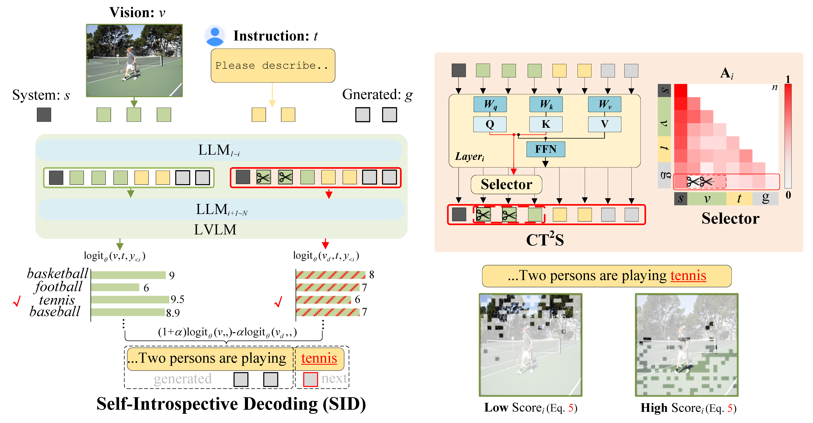
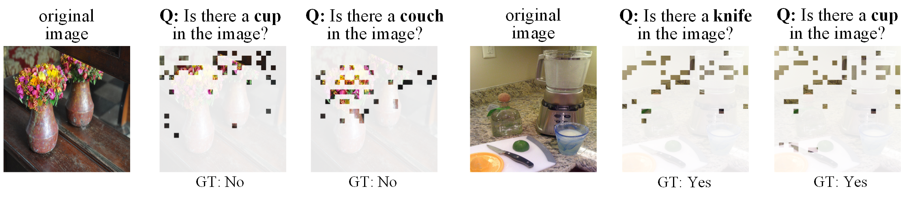
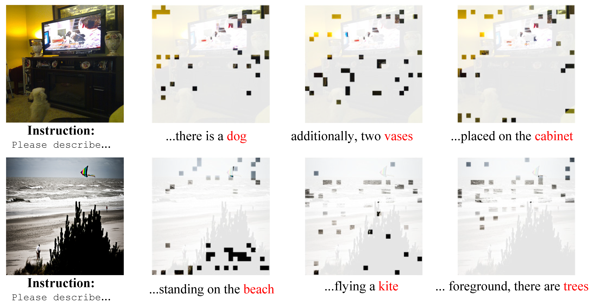

# Self-Introspective Decoding: Alleviating Hallucinations for Large Vision-Language Models


## Overview

<p align="center"></p>

While Large Vision-Language Models (LVLMs) have rapidly advanced in recent years, the prevalent issue known as the ‘hallucination’ problem has emerged as a significant bottleneck, hindering their real-world deployments. Existing methods mitigate this issue mainly from two perspectives: One approach leverages extra knowledge like robust instruction tuning LVLMs with curated datasets or employing auxiliary analysis networks, which inevitable incur additional costs. Another approach, known as contrastive decoding, induces hallucinations by manually disturbing the vision or instruction raw inputs and mitigates them by contrasting the outputs of the disturbed and original LVLMs. However, these approaches rely on empirical holistic input disturbances and double the inference cost. To avoid these issues, we propose a simple yet effective method named Self-Introspective Decoding (SID). Our empirical investigation reveals that pretrained LVLMs can introspectively assess the importance of vision tokens based on preceding vision and text (both instruction and generated) tokens. We develop the Context and Text-aware Token Selection (CT2S) strategy, which preserves only unimportant vision tokens after early layers of LVLMs to adaptively amplify text-informed hallucination during the auto-regressive decoding. This approach ensures that multimodal knowledge absorbed in the early layers induces multimodal contextual rather than aimless hallucinations. Subsequently, the original token logits subtract the amplified vision-and-text association hallucinations, guiding LVLMs decoding faithfully. Extensive experiments illustrate SID generates less-hallucination and higher-quality texts across various metrics, without extra knowledge and much additional computation burdens.

<p align="center"></p>
<p align="center"></p>
<b>Self-Introspective Mechanism</b> of pre-trained LVLMs. Retained vision tokens mainly focus on spurious related regions <b>informed by vision and text (both instruction and generated texts)</b>.


## Setup
As we design the LVLMs decoding strategy, it is convenient to use SID by installing our modified `transformers` package.
```
conda env create -f environment.yml
conda activate SID
python -m pip install -e transformers
```
<!-- #### The implement of SID are mainly in:
- `transformers/src/transformers/models/llama/modeling_llama.py`. -->

## Implementation
After setup the environment, you can directly use our code base to imply <b>three LVLMs Decoding-based Hallucination Alleviation methods</b>: Vision Contrastive Decoding ([VCD](https://arxiv.org/abs/2311.16922)), Instruction Contrastive Decoding ([ICD](https://arxiv.org/abs/2403.18715)), [OPERA](https://arxiv.org/abs/2311.17911), and our SID:


```
python pope_eval.py --pope-type coco_adversarial --model llava-1.5  --use-cd  --use-fast-v  --sample  --sample-greedy  #SID_greedy

```
```
python pope_eval.py --pope-type coco_adversarial --model llava-1.5  --use-vcd  --sample  --sample-greedy  #VCD_greedy

```
```
python pope_eval.py --pope-type coco_adversarial --model llava-1.5  --use-icd  --sample  --sample-greedy  #ICD_greedy

```
```
python pope_eval.py --pope-type coco_adversarial --model llava-1.5  --beam 5  #Beam Search

```
```
python pope_eval.py --pope-type coco_adversarial --model llava-1.5  --beam 5  --opera #OPERA

```
The CHAIR metric utilizes the same configuration.


## Evaluation

We provide extensive evaluation metrics including <b>GPT-4V</b> `eval_utils/gpt4v_eval.py` , <b>GPT4</b> `shr_eval.py`, <b>POPE</b> `pope_eval.py`, <b>CHAIR</b> `eval_utils/chair_eval.py`

The following evaluation requires for MSCOCO 2014 / AOKVQA / GPA / Visual Genome dataset. Please download [here](https://cocodataset.org/#home) `dataset/download_cqa.py`,  `dataset/download_ha_dpo.py`,  `dataset/download_visual_genome_v1.2.py` and extract it in the data path.

Besides, it needs you to prepare the following checkpoints of 7B base models:

- Download [LLaVA-1.5 merged 7B model](https://huggingface.co/liuhaotian/llava-v1.5-7b) and specify it at `eval_configs/llava-1.5_eval.yaml`.
- Download [Vicuna 7B v1.1 model](https://github.com/lm-sys/FastChat) and specify it at `minigpt4/configs/models/blip2_instruct_vicuna7b.yaml`.
- Download [Shikra merged 7B model](https://github.com/shikras/shikra#checkpoint) and specify it at  `eval_configs/shikra_eval.yaml`.

### Arguments

| Argument             | Example             | Description   |
| -------------------- | ------------------- | ------------- |
| `--model`    | `llava-1.5` | Specify the LVLM model. |
| `--data-path`     | `/path/to/dataset` | Path to the dataset file or folder. |
| `--pope-type`     | `coco_adversarial` | Type for POPE evaluation. |
| `--sample`        | `store_true` | Use the modified decoding strategy. |
| `--sample-greedy` | `store_true` | Use CD with sampling and greedy decoding. |
| `--beam`         | `5` | Beam search number. |
| `--opera`         | `store_true` | Use OPERA. |


## Acknowledgement
This repo is based on the LVLMs codebase of [OPERA](https://github.com/shikiw/OPERA), [VCD](https://github.com/DAMO-NLP-SG/VCD), and [HA-DPO](https://opendatalab.github.io/HA-DPO/) . Thanks for their excellent works!

<!-- ## Citation
If you find this work useful for your research, please cite [our paper](https://arxiv.org/pdf/2311.17911.pdf):
```
@article{
}
``` -->


